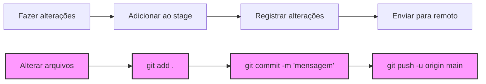

# Sistema Bibliotecário em Python

Autores: Douglas Lobo, Flávio Marques, Kíria Amanájas, Tiago Novo

---

- [Sistema Bibliotecário em Python](#sistema-bibliotecário-em-python)
  - [Objetivos](#objetivos)
    - [Fase 1: Planejamento e Organização](#fase-1-planejamento-e-organização)
    - [Diretório `helpers/` – Funções Auxiliares](#diretório-helpers--funções-auxiliares)
    - [Diretório `models/` – Modelos de Dados](#diretório-models--modelos-de-dados)
    - [Fase 3: Desenvolvimento da Interface de Linha de Comando (CLI)](#fase-3-desenvolvimento-da-interface-de-linha-de-comando-cli)
    - [Fase 4: Melhoria da Experiência do Usuário](#fase-4-melhoria-da-experiência-do-usuário)
  - [Nosso Método](#nosso-método)
  - [Estrutura do Projeto](#estrutura-do-projeto)
    - [O que é um modelo](#o-que-é-um-modelo)
    - [Exemplo de uso no código](#exemplo-de-uso-no-código)
      - [Diferença entre `User.add()`, `db.add()` e `add()`](#diferença-entre-useradd-dbadd-e-add)
      - [Por que isso é melhor?](#por-que-isso-é-melhor)
    - [O que é um helper](#o-que-é-um-helper)
    - [O que é BREAD](#o-que-é-bread)
    - [O que é um decorador (@qualquer-coisa-em-cima)](#o-que-é-um-decorador-qualquer-coisa-em-cima)
      - [Classe, objeto, método estático?](#classe-objeto-método-estático)
    - [Sistema de Recomendações](#sistema-de-recomendações)
    - [\_: KW\_ONLY](#_-kw_only)
  - [Extensões recomendadas](#extensões-recomendadas)
  - [Como começar a trabalhar com o projeto?](#como-começar-a-trabalhar-com-o-projeto)
    - [Git](#git)
    - [Como configurar o Git no Windows](#como-configurar-o-git-no-windows)
    - [Python](#python)
      - [Links úteis](#links-úteis)
  - [Usando o Git (no projeto)](#usando-o-git-no-projeto)
  - [Como rodar o programa e começar a trabalhar e testar?](#como-rodar-o-programa-e-começar-a-trabalhar-e-testar)
    - [Registrando o progresso](#registrando-o-progresso)
    - [Utilidades](#utilidades)
    - [O que é HEAD, main?](#o-que-é-head-main)

---

## Objetivos

### Fase 1: Planejamento e Organização

- [x] Alinhar a equipe e definir os fundamentos do projeto
- [x] Avaliar e distribuir tarefas entre os membros

### Diretório `helpers/` – Funções Auxiliares

- [x] `database.py`: Implementar funções para manipulação eficiente da base de dados
- [ ] `queue.py`: Criar funções para gerenciamento da fila de empréstimos
- [ ] `notifications.py`: Desenvolver funções para envio de notificações aos usuários
- [ ] `recommendations.py`: Criar funções para geração de recomendações personalizadas

### Diretório `models/` – Modelos de Dados

- [x] `lendings.py`: Implementar modelo para controle de empréstimos
- [x] `users.py`: Criar modelo para gerenciamento de usuários
- [x] `books.py`: Desenvolver modelo para gerenciamento de livros
- [ ] `audit.py`: Desenvolver modelo para registrar auditoria de ações no sistema

### Fase 3: Desenvolvimento da Interface de Linha de Comando (CLI)

- [ ] Criar a interface de linha de comando (CLI) para interação inicial com o sistema
- [ ] Permitir gerenciamento de livros, usuários e empréstimos via terminal

### Fase 4: Melhoria da Experiência do Usuário

- [ ] Desenvolver interface gráfica com [PyQt](https://doc.qt.io/qtforpython-6/) para aprimorar a usabilidade do sistema após a implementação da CLI

---

## Nosso Método

- Utilizaremos *typing hints* no projeto, conforme o [guia de cheat sheet do mypy](https://mypy.readthedocs.io/en/stable/cheat_sheet_py3.html), para garantir tipagem estática e melhorar a clareza do código.
- O inglês será adotado como padrão para a nomeação de variáveis e funções, enquanto a documentação será escrita em português.
- A estrutura das pastas reflete a função de cada módulo:
  - `helpers`: Módulos auxiliares, contendo funções de apoio e utilitários que não são o foco principal da aplicação.
  - `models`: Módulos responsáveis pela manipulação dos modelos de dados, que correspondem às tabelas da base de dados.
- Comentaremos processos e fluxos importantes, evitando explicações excessivas. O código deve ser suficientemente claro para ser compreendido sem a necessidade de comentários em cada linha.
  
## Estrutura do Projeto

```file
sistema-bibliotecario/      # Diretório raiz do projeto
    helpers/                # Módulo helpers
        database.py         # Funções auxiliares para manipulação da base de dados
        queue.py            # Funções auxiliares para manipulação de filas
        notifications.py    # Funções para envio de notificações
        recommendations.py  # Funções para gerar recomendações
    models/                 # Módulo models
        audit.py            # Modelo para auditoria de ações
        lendings.py         # Modelo para empréstimos
        users.py            # Modelo para usuários
        books.py            # Modelo para livros
    main.py                 # Ponto de entrada do programa
```

### O que é um modelo

Um modelo é uma representação abstrata de uma tabela do banco de dados. Por exemplo, a tabela `books` será representada pelo modelo `Book`. Isso permite que as interações no código ocorram com objetos do tipo `Book`, ao invés de simples dicionários ou estruturas de dados. Esse conceito melhora a organização e a flexibilidade do código, além de possibilitar o uso de métodos específicos para manipulação dos dados.

Por exemplo, considere o seguinte código que usa um **dicionário** para representar um livro:

```python
book = {title: "1984", 
        publication_date: "1949-09-31", 
        synopsis: "A dystopian future.",
        publisher: "Edipro",
        genres: "Drama|Suspense|Ficção Científica"}

print(f"Livro: {book['title']}")
# Livro: 1984
```

Embora este código funcione para armazenar dados, ele não permite a flexibilidade de adicionar comportamentos específicos. Agora, veja como isso muda com a classe `Book`:

```python
book = Book(title="1984", 
        publication_date="1949-09-31", 
        synopsis="A dystopian future.",
        publisher="Edipro",
        genres="Drama|Suspense|Ficção Científica")

print(f"Livro: {book.title}")
# Livro: 1984
```

Aqui, o objeto `book` é uma instância (um objeto criado a partir de uma classe, contendo valores específicos e comportamentos definidos nela) de `Book`, e você pode acessar atributos e métodos específicos da classe, tornando a interação mais eficiente e robusta.

### Exemplo de uso no código

Usando a classe `Book`, podemos executar ações mais complexas, como enviar notificações. Por exemplo:

```python
from helpers import notifications

book = Book.read(1)  # Obtendo o livro pelo ID
user = User.read(3)  # Obtendo o usuário pelo ID

notifications.send_email(
    user_email=user.email, 
    corpo_do_email=f"Obrigado {user.name}, por devolver a tempo o livro {book.title} de {book.authors}."
)
# Exemplo de saída: "Obrigado Tiago, por devolver a tempo o livro 1984 de George Orwell."
```

Neste caso, ao usar um modelo como `Book`, conseguimos acessar o título e o autor do livro diretamente, além de possibilitar a execução de métodos que tornam o código mais modular e organizado.

#### Diferença entre `User.add()`, `db.add()` e `add()`

A distinção entre essas funções promove um código mais modular, reutilizável e fácil de manter, permitindo que mudanças sejam feitas em uma camada sem afetar as outras.

1. **`User.add()` (main.py)**: Método específico para adicionar um novo usuário no sistema, lidando com validações e ações de negócio antes da inserção. Está focado no modelo `User`.

2. **`db.add()` (users.py)**: Encapsula a lógica de inserção no banco de dados, abstraindo detalhes de SQL e tornando o código mais limpo e reutilizável para outros modelos além de `User`.

3. **`add()` (database.py)**: Localizada no módulo auxiliar, essa função constrói e executa queries SQL para inserção de dados, centralizando a lógica e evitando duplicação de código.

#### Por que isso é melhor?

Essa abordagem modular tem várias vantagens claras:

- **Separação de responsabilidades**: Cada função é responsável por uma tarefa específica, como validar dados ou inserir no banco de dados, o que facilita tanto a manutenção quanto a expansão do código.
  
- **Reusabilidade e Flexibilidade**: Funções como `db.add()` podem ser usadas para adicionar diferentes tipos de dados sem precisar escrever a mesma lógica de inserção toda vez. Isso torna o código mais reutilizável e adaptável.

- **Facilidade de manutenção**: Se for necessário alterar a maneira como os dados são inseridos no banco, como mudar uma query SQL, isso pode ser feito no helper `add()` sem afetar outras partes do sistema, como a validação dos dados.

Essa estrutura organizada facilita entender e modificar o código, melhora a segurança e torna o desenvolvimento de novas funcionalidades mais simples e rápido.

---

### O que é um helper

Um módulo helper contém funções auxiliares que evitam a repetição de código, centralizando tarefas específicas usadas em várias partes do sistema, como manipulação de banco de dados (adicionar, editar, deletar registros).

### O que é BREAD

O [BREAD](https://github.com/thangchung/clean-architecture-dotnet/wiki/BREAD-vs-CRUD) (Browse, Read, Edit, Add, Delete) define as operações básicas de manipulação de dados em um sistema. Elas devem ser simples, reutilizáveis e aplicáveis a diferentes tabelas de dados.

**BREAD** inclui:

- **Browse**: Buscar todos os registros de uma tabela.
- **Read**: Ler um registro específico.
- **Edit**: Editar um registro existente.
- **Add**: Adicionar um novo registro.
- **Delete**: Deletar um registro existente.

Essas operações são implementadas de forma genérica para serem utilizadas por diferentes modelos, como `User`, `Book`, `Lending`, etc.

### O que é um decorador (@qualquer-coisa-em-cima)

Um decorador é uma forma de modificar ou estender o comportamento de uma função ou método, usando a sintaxe `@decorador`. Ele permite adicionar funcionalidades extras sem alterar o código original da função. Por exemplo, o decorador `@staticmethod` transforma um método em estático, permitindo que seja chamado pela classe diretamente, sem precisar de uma instância.

Exemplo com decorador:

```py
class Weather:
    def __init__(self):
        pass
    
    @staticmethod
    def is_rainy():
        return "it's rainy!"

print(Weather.is_rainy())
# Output: it's rainy!
```

Sem o decorador, precisaríamos instanciar um objeto para acessar o método, mesmo que não usemos a instância, o que é menos eficiente:

```py
class Weather:
    def __init__(self):
        pass

    def is_rainy():
        return "it's rainy!"

weather_object = Weather()

print(weather_object.is_rainy())
# Output: it's rainy!
```

#### Classe, objeto, método estático?

- Classe: Um molde para criar objetos, definindo atributos e comportamentos (métodos).
- Instanciar: Criar um objeto baseado em uma classe.
- Métodos estáticos: Funções dentro de uma classe que não dependem de instância; chamados diretamente pela classe.

### Sistema de Recomendações

O sistema de recomendações sugere livros com base nos empréstimos feitos por um usuário no último ano. O processo funciona da seguinte maneira:

1. **Coleta dos empréstimos**: Analisamos os empréstimos do usuário no último ano e coletamos os gêneros dos livros emprestados.

2. **Ranking dos gêneros**: A partir dessa coleta, criamos um ranking dos gêneros mais solicitados, identificando os dois mais populares.

3. **Escolha do gênero menos solicitado**: Para evitar recomendações tendenciosas, selecionamos o gênero menos solicitado de todos como contrapeso.

4. **Geração das recomendações**: O sistema gera recomendações baseadas nos dois gêneros mais solicitados e no gênero menos solicitado, equilibrando as preferências do usuário com novas sugestões.

Esse modelo oferece recomendações mais personalizadas, ampliando os horizontes do usuário, além de sugerir livros dentro dos seus interesses.

### _: KW_ONLY

O `_:KW_ONLY` em `dataclass` do Python força que todos os campos definidos após ele sejam passados apenas como argumentos nomeados (ou seja, `param=arg`). Isso torna o código mais claro e seguro, pois evita o uso acidental de argumentos posicionais, que podem causar erros difíceis de identificar. Além disso, melhora a legibilidade, deixando claro quais parâmetros precisam ser definidos ao instanciar o objeto.

## Extensões recomendadas

- [autopep8](https://marketplace.visualstudio.com/items?itemName=ms-python.autopep8)
- [Error Lens](https://marketplace.visualstudio.com/items?itemName=usernamehw.errorlens)
- [IntelliCode](https://marketplace.visualstudio.com/items?itemName=VisualStudioExptTeam.vscodeintellicode)
- [IntelliCode API Usage Examples](https://marketplace.visualstudio.com/items?itemName=VisualStudioExptTeam.intellicode-api-usage-examples)
- [Import Cost](https://marketplace.visualstudio.com/items?itemName=wix.vscode-import-cost)
- [Live Server](https://marketplace.visualstudio.com/items?itemName=ritwickdey.LiveServer)
- [Pylance](https://marketplace.visualstudio.com/items?itemName=ms-python.vscode-pylance)
- [Python](https://marketplace.visualstudio.com/items?itemName=ms-python.vscode-pylance)
- [Python Indent](https://marketplace.visualstudio.com/items?itemName=KevinRose.vsc-python-indent)
- [SQLTools](https://marketplace.visualstudio.com/items?itemName=mtxr.sqltools)
- [SQLTools SQLite](https://marketplace.visualstudio.com/items?itemName=mtxr.sqltools-driver-sqlite)
- [Markdown Preview Enhanced](https://marketplace.visualstudio.com/items?itemName=shd101wyy.markdown-preview-enhanced)
- [Markdown All in One](https://marketplace.visualstudio.com/items?itemName=yzhang.markdown-all-in-one)

## Como começar a trabalhar com o projeto?

### Git

Para começar a trabalhar no projeto, você precisa ter o Git e o Python instalados no seu computador. No Windows, o processo de instalação do Git é diferente, e você precisa configurar o Git como variável de ambiente para usá-lo no Command Prompt (cmd).

### Como configurar o Git no Windows

1. **Abrir configurações de variáveis de ambiente**: Pesquise por "Variáveis de Ambiente" no menu Iniciar e clique em “Editar variáveis de ambiente do sistema”.
2. **Adicionar o caminho do Git**: Na seção "Variáveis do Sistema", selecione o `Path`, clique em "Editar" e adicione o caminho onde o Git está instalado (exemplo: `C:\Program Files\Git\bin`).
3. **Salvar e reiniciar o terminal**: Após salvar, reinicie o terminal para aplicar as alterações.

Agora você poderá usar o Git diretamente no terminal sem ler a enfadonha mensagem abaixo!


### Python

Depois de instalar o Python, você precisa configurá-lo no *Path* do sistema. Para isso, siga os passos abaixo:

1. **Abrir configurações de variáveis de ambiente**:
   - Pressione `Win + R`, digite `sysdm.cpl` e pressione `Enter`. No menu "Propriedades do Sistema", clique em **Configurações Avançadas do Sistema** e depois em **Variáveis de Ambiente**.

2. **Adicionar Python ao PATH**:
   - Em "Variáveis do Sistema", selecione a variável `Path` e clique em **Editar**.
   - Clique em **Novo** e adicione o caminho onde o Python está instalado (use `where python` para encontrar o local).

3. **Salvar e testar**:
   - Clique em **OK** para salvar. Abra o **Prompt de Comando** e digite `python --version` para verificar se a configuração foi bem-sucedida.

#### Links úteis

- [Documentação oficial do Python](https://docs.python.org/3/using/windows.html#configuring-python)

## Usando o Git (no projeto)

Para aprender Git, recomendo ler o [ebook oficial do Git](https://git-scm.com/book/pt-pt/v2/Come%c3%a7ando-Sobre-Controle-de-Vers%c3%a3o).

1. Sempre que começarem, usem `git pull origin main` para garantir que estão com a versão mais recente do projeto.
2. Antes de fazer `git push -u origin main`, sempre façam `git pull origin main` para evitar conflitos.
3. Use `git status` para verificar o estado do seu repositório.
4. Para ver os commits, use o comando `git tree` (adicione com `git config alias.tree "log --graph --decorate --pretty=oneline --abbrev-commit"`).
5. Ao escrever mensagens de commit, sigam essas dicas:
   - **Evitem mensagens vagas ou genéricas** como `fix`, `update`, ou `roberto carlos`.
   - **Sejam específicos** sobre o que o commit fez. Exemplos:
     - `implementei uma função para enviar e-mails`
     - `refatorei a função de recomendação de livros com base nas últimas solicitações do usuário`

Não há uma convenção rígida, mas mensagens claras são sempre preferíveis.

## Como rodar o programa e começar a trabalhar e testar?

Antes de começar, ative seu ambiente virtual (venv) com:

- Para Windows: `.\venv\Scripts\activate`
- Para Linux: `source venv/bin/activate`

Depois, faça `git pull origin main` para garantir que está com a versão mais recente do código.

### Registrando o progresso

Os arquivos podem estar em quatro estados no Git, como mostrado na imagem abaixo [(Git Basics)](https://git-scm.com/book/en/v2/Git-Basics-Recording-Changes-to-the-Repository):


- **M**: Arquivo modificado.
- **U**: Arquivo não rastreado.

No VSCode, os estados são mostrados diretamente. Para adicionar modificações ao estágio, use:

- `git add .` para adicionar todos os arquivos modificados.
- `git add arquivo.py` para adicionar arquivos específicos.

Depois de adicionar, registre as alterações com:

```bash
git commit -m "Sua mensagem de commit"
```

Por fim, envie as alterações para o repositório remoto com:

```bash
git push -u origin main
```



### Utilidades

Para verificar os teus commits, use o comando git log. Isso exibirá o histórico de commits realizados no repositório.

Se precisar reverter um commit ou verificar diferenças, use os seguintes comandos:

- Verificar as diferenças antes de commit (diff):
`git diff` (`h`, `j`, `k` e `l` para mover-se pela esquerda, baixo, cima e direita. Para sair é `q`)
Mostra as diferenças não adicionadas entre os arquivos e o repositório.
- Verificar diferenças entre commits (log):
`git log`
Mostra o histórico de commits realizados, com o ID do commit, autor, data e mensagem.
- Reverter um commit:
`git revert <commit-id>`
Cria um novo commit que desfaz as alterações de um commit específico.

- Para remover arquivos da área de stage sem perder as alterações feitas, use o comando:
`git restore --staged <arquivo>`
Isso vai desmarcar o arquivo para commit, mas mantém as modificações no seu diretório de trabalho.

- Se você precisar reverter o estado de todo o repositório para o último commit e manter as mudanças no diretório de trabalho, use o reset soft:
`git reset --soft HEAD~1`
Isso move o ponteiro do HEAD para o commit anterior, mas mantém as modificações no diretório de trabalho e na área de stage.

- Evite usar o reset hard sem cautela, pois ele descarta todas as modificações no diretório de trabalho e no stage:
`git reset --hard HEAD~1`
Isso vai mover o HEAD para o commit anterior e apagar permanentemente todas as alterações não registradas. É útil apenas quando você quer descartar tudo e voltar a um estado anterior, mas deve ser evitado se houver trabalho não commitado.

- Para modificar o último commit sem alterar o conteúdo, use o comando:
`git commit --amend`
Isso permite que você altere a mensagem do último commit ou adicione novas alterações a ele.

- Para verificar o estado atual do repositório, use o comando:
`git status`
Ele mostra os arquivos modificados, os que estão no stage, e os que ainda não foram adicionados ao stage.

- Para adicionar um alias no Git, use o comando (**RECOMENDADO**):
`git config --global alias.tree "log --graph --decorate --pretty=oneline --abbrev-commit"`
Isso cria o alias `git tree`, que exibe o histórico de commits em um formato gráfico, com abreviações de commit e decorações, de forma concisa. Resultado:


### O que é HEAD, main?

O HEAD é um ponteiro que aponta para o commit atual em que você está no repositório, e main é o nome padrão da *branch* principal onde geralmente o código final e estável é mantido.
